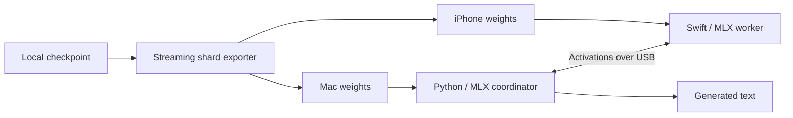

# MLX Peer

**Local AI across your Mac and iPhone. Put the hardware you already own to work together.**

The **0.2 companion preview** adds a native Mac chat app, an iPhone pairing screen, one-time USB pairing, automatic model preparation, and verified, resumable model transfers. Choose a supported local Qwen2 / Qwen2.5 folder on your Mac; the iPhone computes its assigned layers while the Mac runs the rest.

[Download the Mac preview](https://github.com/samuelreyes982/mlx-peer/releases) · [Install and pair](docs/COMPANION.md) · [Build the iPhone app](ios/README.md#run-on-a-physical-iphone)

**A direct USB cable connection is required. Wi-Fi inference is not supported.** For conversations, choose a supported **Instruct** checkpoint; base checkpoints are intended for text completion.

**Developer preview:** Apple Silicon only. The Mac ZIP includes its runtime but is not yet Developer ID signed/notarized. The iPhone app currently installs through Xcode; there is no App Store or public TestFlight release yet. Short conversations, supported small models, and foreground USB sharing only. Read the [requirements and limits](docs/COMPANION.md) before downloading.

MLX Peer partitions a language model into device-specific weight files. A Python coordinator runs the Mac's assigned layers while a Swift/MLX iPhone worker executes its own layers and retains its local model state. The goal is to study whether a nearby phone can extend the practical capacity of a memory-constrained Mac.

Our longer-term aim is to make existing personal devices more useful before asking people to buy more hardware. Reduced energy use, mining, data-center demand, or electronic waste are goals to investigate, not measured benefits of this preview.

Built with **Python · Swift / SwiftUI · MLX · Metal**. A community project by [Samuel Reyes](https://github.com/samuelreyes982); not affiliated with Apple.

[Recorded results](#recorded-results) · [Setup](#getting-started) · [Developer guide](docs/DEVELOPMENT.md) · [iPhone worker](ios/README.md)

## How it works



- Stream weight partitions without first allocating the complete model.
- Construct only each device's assigned layers, with local KV/recurrent state.
- Exchange activations through an authenticated USB developer transport.
- Compare outputs with Python references, including prefill and cached continuation.
- Stop on configured memory/time guards and record experiment evidence.

## Recorded results

| Experiment | Observation | Evidence |
| --- | --- | --- |
| Qwen2.5-0.5B | Physical iPhone stage matched reference checks; a 24-token continuation ran across both devices | [USB report](docs/USB_PROBE.md) |
| USB transport | 0.461 ms median request round trip; 36.38 / 42.74 MB/s payload throughput | [Transport measurements](docs/USB_PROBE.md) |
| Exploratory 27B split | iPhone 16 executed 12 layers containing 2.57 GB of weights; one short run reached 3.93 decode tokens/sec | [27B report](docs/QWEN38_SPLIT.md) |
| Functional retest | Five short checks completed on a retry, including arithmetic, JSON, and repeated-token agreement | [Retest report](docs/QWEN38_FUNCTIONAL_RETEST.md) |

**The 27B path is experimental.** Its 12-layer prefill comparison still fails the original numerical tolerance. The short successful run used substantial Mac swap; sustained stability, long-context behavior, quality, and a controlled capacity improvement have not been established. These results are individual debug-build experiments, not a general speedup claim.

Machine-readable measurements accompany the reports. Model weights, private device identifiers, authentication tokens, and generated artifacts are not included.

## Getting started

For the native companion app, follow the [Mac + iPhone quick start](docs/COMPANION.md). The commands below are for development and the original experiments.

The full experiment requires Apple Silicon, Python 3.12, Xcode with the Metal Toolchain and Swift 6.3, and a physical iPhone for the remote stage. Tested versions and reproduction details are in the [developer guide](docs/DEVELOPMENT.md#development-environment-and-dependencies).

```sh
git clone https://github.com/samuelreyes982/mlx-peer.git
cd mlx-peer
python3.12 -m venv .venv
source .venv/bin/activate
python -m pip install -r requirements-lock.txt
python -m pip install --no-build-isolation --no-deps -e .
```

Start with a small local Qwen2/Qwen2.5 checkpoint and synthetic fixtures. The original Qwen2 commands are separate from the experimental hybrid 27B path:

```sh
mlx-peer inspect /path/to/qwen2-checkpoint
mlx-peer plan /path/to/qwen2-checkpoint --start 4 --end 8 --context 4096
mlx-peer split /path/to/qwen2-checkpoint artifacts/my-split --start 4 --end 8
```

Open `ios/App/MLXPeerApp.xcodeproj` and follow the [worker setup](ios/README.md#run-on-a-physical-iphone). Choose your own signing team and bundle identifier. Keep the worker in the foreground. See [the USB procedure](docs/USB_PROBE.md#reproduction) and [hybrid experiment instructions](docs/QWEN38_SPLIT.md) before running a two-device test.

No model download is required for the tiny synthetic tests. Real-checkpoint experiments require separately obtained weights and enough memory on both devices.

## Validation

Portable protocol, manifest, and capacity checks:

```sh
python -m pip install -e '.[test]'
python -m pytest -q tests/test_bundle.py tests/test_capacity.py tests/test_manifest.py tests/test_wire.py
```

Full Python suite with the pinned MLX runtime on Apple Silicon:

```sh
python -m pytest -q
```

Physical iPhone tests and numerical parity checks are separate from those commands. See [validation records](docs/VALIDATION.md), [physical-device evidence](docs/IPHONE_VALIDATION.md), and [contributing](CONTRIBUTING.md).

## Repository map

| Path | Purpose |
| --- | --- |
| `src/mlx_peer/` | Checkpoint inspection, sharding, coordination, and transport |
| `ios/Sources/` | Swift worker, model stages, and Metal recurrent kernel |
| `ios/App/` | Foreground SwiftUI app and Xcode project |
| `macos/` | Native Mac UI and bundled engine specification |
| `scripts/` | Baseline recording, USB benchmarking, and hybrid validation |
| `tests/` | Portable and MLX-dependent Python checks |
| `docs/` | Reproduction guides, measurements, and known limitations |

## Attribution

MLX Peer uses [MLX](https://github.com/ml-explore/mlx), [MLX-LM](https://github.com/ml-explore/mlx-lm), and [MLX Swift](https://github.com/ml-explore/mlx-swift). The Swift recurrent Metal kernel ports MLX-LM code; its [MIT notice](licenses/MLX-LM-MIT.txt) is retained. Dependencies and separately downloaded checkpoints retain their own licenses.
